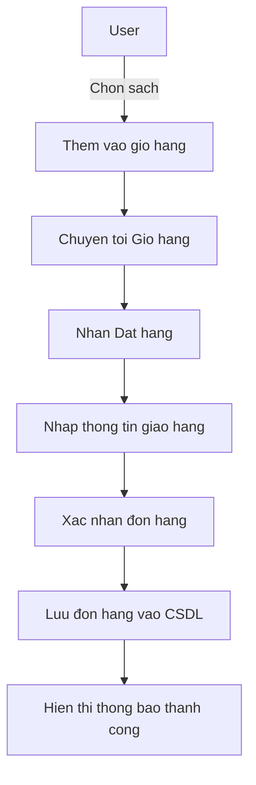
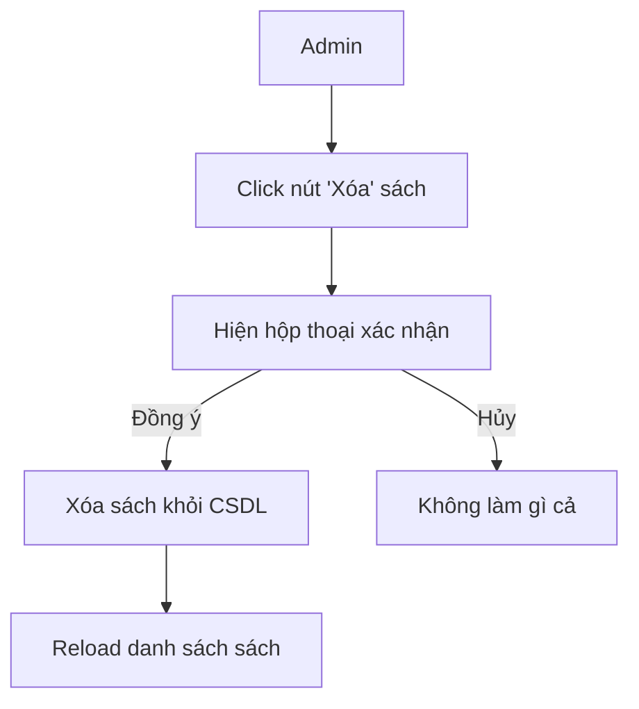
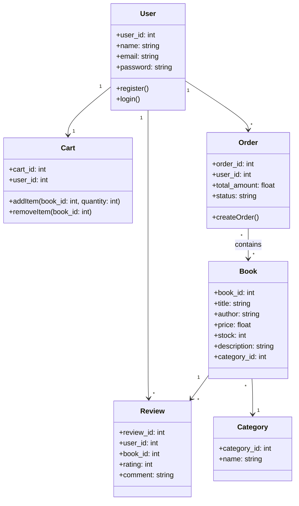

#  Wed bán sách

 **Môn học:** Thiết kế Web nâng cao

 **Tên dự án:** Wed bán sách

 **Nhóm thực hiện:** Nhóm 12 – Lớp [Thiết kế Web nâng cao - TH2]

| **STT** |  **Họ và Tên**    |  **Email**                                                              |
| :--------: | :------------------ | :------------------------------------------------------------------------ |
|     1      | **Bùi Minh Quân **      | 23010725@st.phenikaa-uni.edu.vn  |
|     2      | **Nguyễn Văn Thành **    | 23010764@st.phenikaa-uni.edu.vn |
|     3      | **Ngô Ngọc Duy ** | 23010397@st.phenikaa-uni.edu.vn  |

# Tên dự án : Wed bán sách

# Mô tả dự án:
    -Là một trang web bán sách trực tuyến được xây dựng bằng Laravel.
    -Người dùng có thể đăng ký, đăng nhập, xem danh sách sách, tìm kiếm, thêm vào giỏ hàng và   đặt hàng.
    -Quản trị viên (Admin) có thể quản lý sách, danh mục, người dùng và đơn hàng.
    -Hệthống sử dụng các models chính như: User, Book, Cart, Order, Review, Category.
    -Hướng tới thiết kế MVC rõ ràng, dễ mở rộng trong tương lai.
    
# Chức năng chính:
 ✔️ Đăng ký, xác thực email, đăng nhập, đặt lại mặt khẩu 
 ✔️ Quản lý danh mục sách (Thêm/Sửa/Xóa)  
 ✔️ Tìm kiếm và lọc sách theo tiêu đề, tác giả  
 ✔️ Hệ thống giỏ hàng và thanh toán trực tuyến  
 ✔️ Quản lý tài khoản người dùng và đơn hàng  
 ✔️ Giao diện thân thiện, responsive với Bootstrap 
 ✔️ Quản lý khách hàng, hóa đơn 

# Ngôn ngữ sử dụng:
 HTML, CSS, JavaScript, PHP, Bootstrap, MySQL,.....
 
# Cấu trúc thư mục:
-Admin: Chứa các tệp PHP liên quan đến phần quản trị trang web. 
-Css: Chứa các tệp CSS để định dạng giao diện trang web. 
-Images: Chứa các hình ảnh được sử dụng trong trang web. 
-Js: Chứa các tệp JavaScript để thêm tính năng tương tác. 
-Uploaded_img: Chứa các hình ảnh sản phẩm được tải lên. 
-Các tệp PHP 

# Cơ sở dữ liệu:

 
 
# Sơ đồ chức năng (Use case diagram):

# Activity Diagram (Ví dụ: Đặt hàng - Place Order):

# Activity Diagram (Ví dụ: Xoá sách - Admin)

# Class Diagram 

# Sơ đồ thuật toán

# Giao diện chính của web

# Giao diện admin 

# Giao diện danh mục sách, tìm kiếm, top bán chạy

# Giao diện thanh toán

# Liên kết kho lưu trữ : 
 https://github.com/BuiQuan1702/webnangcao

